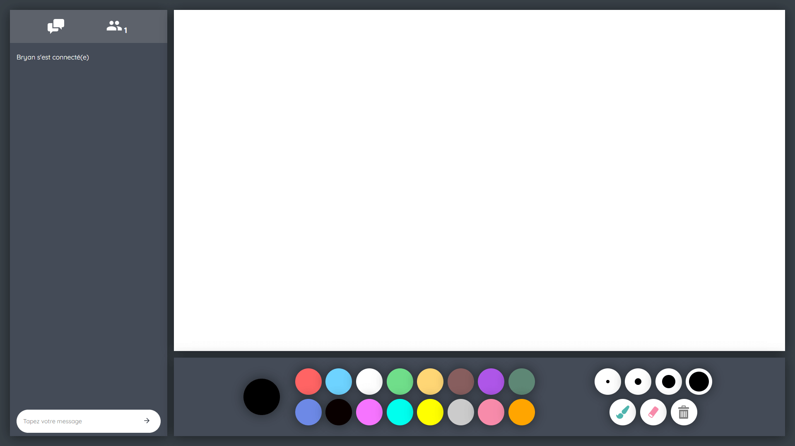

# Draw Together 🎨🖌️
## Qu'est-ce que c'est ?
Une application de dessins collaboratifs réalisée avec Vue, Node.js, Socket.IO et l'API Canvas.



## Installation

Installer les dépendances du serveur ( ```\drawtogether``` )
```
npm install 
```

</br>

Installer les dépendances du client ( ```\drawtogether\client``` )
```
npm install
```

</br>

Compiler avec hot-reload pour le développement ( ```\drawtogether\client``` )
```
npm run serve
```

</br>

Linter les fichiers ( ```\drawtogether\client``` )
```
npm run lint
```

</br>

Compiler et minifier pour la mise en production ( ```\drawtogether\client``` )
```
npm run build
```

</br>

Lancer le serveur ( ```\drawtogether``` )
```
npm run start
```
